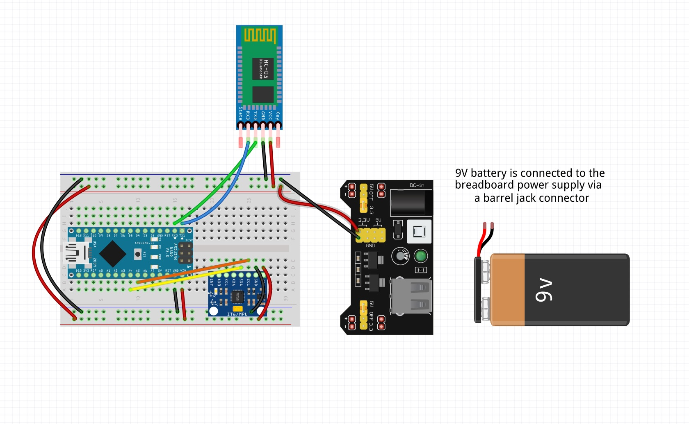

# Gesture Controlled Robot
In this project, I am building a hand-gesture controlled robot. Users can control the robot through the hand module. For example, if the user tilts their hand forward, the robot will move forwards. The project contains two main modules: the main car robot and a hand module that is used to control the car. I am using an Arduino Nano 33 BLE Sense with an accelerometer on the hand module to pick up tilt in different directions, and transmits that data wirelessly through a HC-05 Bluetooth module to a second HC-05 module on the robot itself. An Arduino Uno clone reads the incoming signals and and controls a motor driver shield connected to four DC motors, translating hand tilts into forward, backward, left, and right movement. I plan to add a speed boost mode modification, allowing the user to trigger a temporary motor speed increase through an additional gesture.


| **Engineer** | **School** | **Area of Interest** | **Grade** |
|:--:|:--:|:--:|:--:|
| Anshi T. | Jumeirah College Dubai | Aerospace Engineering | Incoming Senior

<!--- **Replace the BlueStamp logo below with an image of yourself and your completed project. Follow the guide [here](https://tomcam.github.io/least-github-pages/adding-images-github-pages-site.html) if you need help.** --->


  
# Final Milestone

<iframe width="560" height="315" src="https://www.youtube.com/embed/FyMvqE007cM?si=BBMGPRLJ5k9idk1A" title="YouTube video player" frameborder="0" allow="accelerometer; autoplay; clipboard-write; encrypted-media; gyroscope; picture-in-picture; web-share" referrerpolicy="strict-origin-when-cross-origin" allowfullscreen></iframe>

For the final milestone, I worked on adding modifications to my base project. 

My first modification was making the hand module wireless, meaning it did not have to be attached to my laptop. This was done by attaching the breadboard’s positive and negative power rails to a breadboard power supply and attaching that breadboard power supply to a 9V battery. 

My second modification was adding a speed boost mode. This modification was done entirely through code. I did this by adding a second tilt threshold with a larger minimum angle than the first tilt threshold. Thus, when my hand tilts past this angle, the rotations per second of the motors and wheels increases, making the car travel at a faster speed. 

My final modification was an obstacle avoidance modification. I attached an ultrasonic sensor to the front of the car. If the ultrasonic sensor measures that the distance between the car and an obstacle is 15cm or less, the motors of the car stop and only allows the car to move backwards, avoiding the car from hitting the obstacle. 

My biggest challenge during this milestone was getting the hand module to work wirelessly. Initially, the hand module’s bluetooth module would only send signals to the car’s bluetooth module if the Arduino Nano 33 BLE Sense Rev2 was plugged directly into my laptop. My mentor helped me catch this logic error and I was able to change the code so that it would send signals regardless. Another challenge I faced was with the obstacle avoidance modification. The robot would stop too late and hit the obstacle anyways. This was fixed by increasing the distance threshold that the motors would stop at.

While my project is over, that doesn’t mean I cannot keep improving it! In the future, I would like to  transfer the car components to a better chassis as this one is slightly unstable, causing the motors and wheels to move around a lot. This means the steering and movement of the car is a little less accurate and smooth. 

I really enjoyed this program and learned a lot! I improved my skills with programming Arduinos. I learned how to use and pair bluetooth modules. I learned how to wire breadboards with a lot of components. And so much more! 


# Second Milestone

<iframe width="560" height="315" src="https://www.youtube.com/embed/nz8sKrfr17A?si=N2Qhwa4aTsRMOLTy" title="YouTube video player" frameborder="0" allow="accelerometer; autoplay; clipboard-write; encrypted-media; gyroscope; picture-in-picture; web-share" referrerpolicy="strict-origin-when-cross-origin" allowfullscreen></iframe>

The second milestone connected both halves of the robot together in software: gesture/tilt detection, wireless communication between the hand and car components, and motor response on the car, working as one system.

The hand controller uses an Arduino Nano 33 BLE Sense paired with an MPU6050 sensor to read tilt angles in real time. Once tilt passes a set threshold, the Nano sends a direction command over Bluetooth through a HC-05 Bluetooth module. A second HC-05, connected to the robot's Arduino Uno, picks up that command and converts it into signals for the L298N motor driver, which drives the robot and keeps updating as the hand position changes.

Most of the difficulty was debugging across three layers: sensor, code, and wiring. The MPU6050 wouldn't connect at first, because the library I was using ran a strict device-ID check that clone sensor boards fail. Switching to a different library fixed it, but only after I confirmed with an I2C scanner that the sensor was actually responding. Tilt direction was also backwards for a while (for example, tilting forward triggered a left turn) which turned out to be the sensor's axes sitting rotated relative to how it was worn on the hand; remapping the axes in code solved it. A similar problem happened with the motors, where the physical wiring didn't line up with the pin numbers in the code, causing only one side of the robot’s wheels to turn. Checking my code and referring to the physical wiring of my robot helped me debug this problem. 

With the base project finished, the next phase is implementing modifications to the robot!


# First Milestone

<iframe width="560" height="315" src="https://www.youtube.com/embed/RlMRTpZOGCI?si=E5vtUMKn8YLxuwlT" title="YouTube video player" frameborder="0" allow="accelerometer; autoplay; clipboard-write; encrypted-media; gyroscope; picture-in-picture; web-share" referrerpolicy="strict-origin-when-cross-origin" allowfullscreen></iframe>

My first milestone consisted of assembling and wiring the robot chassis. I bolted four DC motors to the bottom frame and wired them into an L298N motor driver, which was in turn connected to an Arduino Uno responsible for direction and speed control. Power was supplied by two separate 9V batteries: one connected directly to the motor driver, the other to the Uno's barrel jack. Components were mounted with screws or tape depending on the part. To test if the car robot was working as intended, I programmed the robot to drive autonomously in a square pattern, which it did successfully. 

Sourcing parts was the biggest challenge during this milestone. The chassis kit arrived without screws, the Nano's micro-USB port broke off, and the battery clip was fitted with an incompatible connector. Since I am an international student, it takes a long time to reorder the parts I need. So I had to find local versions or alternatives. I used a different chassis kit, sourced a new Nano, and used electrical tape to connect the battery clip to the motor driver. Another challenge I faced was wiring the hand module correctly. At first, I used a voltage divider which I quickly realised I didn’t need when I found out the Nano also operates at 3.3V. 

Next, I will be working on the programming of the robot. I have already connected the HC-05 bluetooth modules and gotten the accelerometer connected: the car’s bluetooth module is receiving gesture/tilt data from the hand’s bluetooth module. I will work on actually making the robot move based on the gesture data it receives from the hand module. 

# Schematics 



# Code

Arudino Nano 33 BLE Sense Code

```c++
#include <Wire.h>
#include <MPU6050_light.h> //used an alternative library since Adafruit didn't work with my accelerometer

MPU6050 mpu(Wire);

const float TILT_THRESHOLD = 25.0;
const float BOOST_THRESHOLD = 45.0; //speed boost modification threshold

char lastCommand = 'S';

void setup() {
  Serial.begin(9600);
  Serial1.begin(38400);

  unsigned long start = millis();
  while (!Serial && millis() - start < 3000) {
    delay(10);
  }

  Wire.begin();
  mpu.begin();
  Serial.println("Calibrating, keep sensor still...");
  mpu.calcOffsets();
  Serial.println("Master ready");
}

void loop() {
  mpu.update();

  float fwdBack = mpu.getAngleX();
  float leftRight = mpu.getAngleY();

  char command = 'S';

  // Check boost first, since it's a stricter/further condition than normal tilt
  if (fwdBack > BOOST_THRESHOLD) {
    command = 'G'; // boost forward
  } else if (fwdBack < -BOOST_THRESHOLD) {
    command = 'H'; // boost backward
  } else if (fwdBack > TILT_THRESHOLD) {
    command = 'F';
  } else if (fwdBack < -TILT_THRESHOLD) {
    command = 'B';
  } else if (leftRight > TILT_THRESHOLD) {
    command = 'L';
  } else if (leftRight < -TILT_THRESHOLD) {
    command = 'R';
  }

  if (command != lastCommand) {
    Serial1.println(command);
    Serial.print("Sent: ");
    Serial.println(command);
    lastCommand = command;
  }

  delay(100);
}
```

Arduino UNO Code

```c++
#include <SoftwareSerial.h>

const int HC05_RX = 3;
const int HC05_TX = 2;
SoftwareSerial HC05(HC05_RX, HC05_TX);

const int ENA = 9;
const int IN1 = 12;
const int IN2 = 11;
const int ENB = 6;
const int IN3 = 7;
const int IN4 = 8;

const int NORMAL_SPEED = 150;
const int BOOST_SPEED = 255;

// Ultrasonic sensor
const int TRIG_PIN = 4;
const int ECHO_PIN = 5;
const int OBSTACLE_DISTANCE = 15; // in cm... tune this based on testing

char currentCommand = 'S'; 
unsigned long lastDistanceCheck = 0;
const unsigned long DISTANCE_CHECK_INTERVAL = 100; // in ms

void setup() {
  pinMode(ENA, OUTPUT); pinMode(IN1, OUTPUT); pinMode(IN2, OUTPUT);
  pinMode(ENB, OUTPUT); pinMode(IN3, OUTPUT); pinMode(IN4, OUTPUT);
  pinMode(TRIG_PIN, OUTPUT);
  pinMode(ECHO_PIN, INPUT);
  stopMotors();

  Serial.begin(9600);
  HC05.begin(38400);
  Serial.println("Slave ready");
}

void loop() {
  // Handle incoming Bluetooth commands
  if (HC05.available()) {
    String message = HC05.readStringUntil('\n');
    message.trim();
    Serial.print("Received: ");
    Serial.println(message);

    if (message.length() > 0) {
      currentCommand = message.charAt(0);
      executeCommand(currentCommand);
    }
  }

  // Continuously check distance, independent of incoming messages
  if (millis() - lastDistanceCheck >= DISTANCE_CHECK_INTERVAL) {
    lastDistanceCheck = millis();
    long distance = getDistanceCM();

    bool movingForward = (currentCommand == 'F' || currentCommand == 'G');

    if (movingForward && distance > 0 && distance < OBSTACLE_DISTANCE) {
      Serial.print("Obstacle detected at ");
      Serial.print(distance);
      Serial.println("cm — stopping");
      stopMotors();
    }
  }
}

void executeCommand(char command) {
  if (command == 'F') moveForward(NORMAL_SPEED);
  else if (command == 'G') moveForward(BOOST_SPEED);
  else if (command == 'B') moveBackward(NORMAL_SPEED);
  else if (command == 'H') moveBackward(BOOST_SPEED);
  else if (command == 'L') turnLeft(NORMAL_SPEED);
  else if (command == 'R') turnRight(NORMAL_SPEED);
  else stopMotors();
}

long getDistanceCM() {
  digitalWrite(TRIG_PIN, LOW);
  delayMicroseconds(2);
  digitalWrite(TRIG_PIN, HIGH);
  delayMicroseconds(10);
  digitalWrite(TRIG_PIN, LOW);

  long duration = pulseIn(ECHO_PIN, HIGH, 30000); // 30ms timeout
  if (duration == 0) return -1; // no echo received

  long distance = duration * 0.034 / 2; // speed of sound conversion
  return distance;
}

void moveForward(int speed) {
  digitalWrite(IN1, HIGH); digitalWrite(IN2, LOW);
  digitalWrite(IN3, HIGH); digitalWrite(IN4, LOW);
  analogWrite(ENA, speed); analogWrite(ENB, speed);
}

void moveBackward(int speed) {
  digitalWrite(IN1, LOW); digitalWrite(IN2, HIGH);
  digitalWrite(IN3, LOW); digitalWrite(IN4, HIGH);
  analogWrite(ENA, speed); analogWrite(ENB, speed);
}

void turnLeft(int speed) {
  digitalWrite(IN1, HIGH); digitalWrite(IN2, LOW);
  digitalWrite(IN3, LOW); digitalWrite(IN4, HIGH);
  analogWrite(ENA, speed); analogWrite(ENB, speed);
}

void turnRight(int speed) {
  digitalWrite(IN1, LOW); digitalWrite(IN2, HIGH);
  digitalWrite(IN3, HIGH); digitalWrite(IN4, LOW);
  analogWrite(ENA, speed); analogWrite(ENB, speed);
}

void stopMotors() {
  analogWrite(ENA, 0);
  analogWrite(ENB, 0);
}
```

# Bill of Materials

| **Part** | **Note** | **Price** | **Link** |
|:--:|:--:|:--:|:--:|
| Car Chassis Kit | Base of the robot | $39.99 | <a href="https://www.amazon.com/dp/B0DJ7BT1V5?ref=cm_sw_r_cso_cp_apin_dp_RCSYWRX92M0H5DJ6HNQA"> Link </a> |
| Screwdriver kit | Includes multiple types of screwdriver ends for different screws | $5.94 | <a href="https://www.amazon.com/Small-Screwdriver-Set-Mini-Magnetic/dp/B08RYXKJW9/"> Link </a> |
| Elegoo Uno R3 (Arduino Uno Clone) | Microcontroller board for the main robot | $14.98 | <a href="https://www.amazon.com/ELEGOO-Board-ATmega328P-ATMEGA16U2-Compliant/dp/B01EWOE0UU"> Link </a> |
| Electronics Kit | General kit for robotics | $14.00 | <a href="https://www.amazon.com/Smraza-Electronics-Potentiometer-tie-Points-Breadboard/dp/B0B62RL725"> Link </a> |
| Breadboard Kit | To build circuits without soldering | $8.79 | <a href="https://www.amazon.com/Breadboards-Solderless-Breadboard-Distribution-Connecting/dp/B07DL13RZH"> Link </a> |
| Arduino Nano 33 BLE Sense | Smaller microcontroller board for the gesture module | $39.70 | <a href="https://www.amazon.com/Arduino-Nano-Sense-headers-ABX00070/dp/B0BQHZ88WD"> Link </a> |
| Micro USB Cable | Allows connection between components & laptop | $5.00 | <a href="https://www.amazon.com/Charging-Transfer-Android-Trustable-MYFON/dp/B098DW7485"> Link </a> |
| Accelerometer | Measures the acceleration of the robot | $9.00 | <a href="https://www.amazon.com/dp/B0D2TJVMNY"> Link </a> |
| HC-05 Bluetooth Serial Pass-through Module | Allows a bluetooth connection between the car robot & hand module | $9.00 | <a href="https://www.amazon.com/DSD-TECH-HC-05-Pass-through-Communication/dp/B01G9KSAF6"> Link </a> |
| Breadboard Power Supply | Allows power to be supplied to the breadboards | $8.00 | <a href="https://www.amazon.com/ALAMSCN-Solderless-Breadboard-Battery-Arduino/dp/B08JYPMCZY"> Link </a> |
| 9V Batteries | Power supply | $8.69 | <a href="https://www.amazon.com/Amazon-Basics-Performance-All-Purpose-Batteries/dp/B00MH4QM1S/"> Link </a> |
| Velcro Tape | Wraps around a hand for the hand module | $8.00 | <a href="https://www.amazon.com/Art3d-Sticky-Double-Sided-Command-Adhesive/dp/B0B58FGF8H"> Link </a> |
| Digital Multimeter | Measures resistance, voltage, and current | $9.99 | <a href="https://www.amazon.com/dp/B0CXM242J1"> Link </a> |


# Other Resources/Examples
- [Using HC05 to Communicate to HC05 - Document](https://docs.google.com/document/d/1EpnEPulXQwPDSK-nKLohqPjpeXNteP2G/edit)
- [How to pair HC-05 Bluetooth Modules - Youtube](https://www.youtube.com/watch?si=-l2P5rZ5elWILJch&v=BXXAcFOTnBo&feature=youtu.be)
- [Car Chassis Kit Setup Video - Youtube](https://youtu.be/9ibnSe1dXdE?si=svh3OIH5EyhMfN34)
